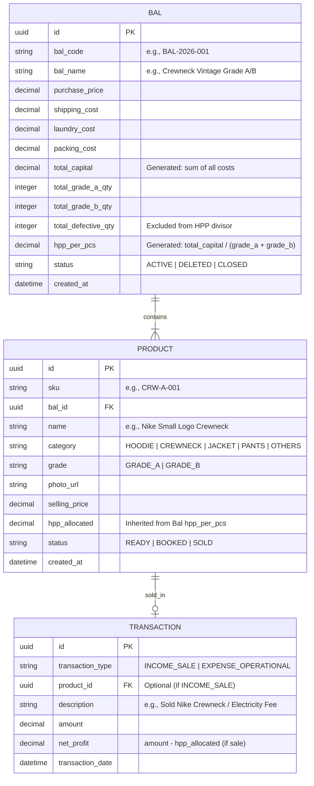

# DESIGN.md - Thrift Finance & Inventory Management Web System

## 1. Project Overview & Vision
A streamlined, single-tenant internal web dashboard built specifically for managing a thrift/secondhand clothing business. The system tracks raw bal purchases, allocates operational overheads into Unit Cost of Goods Sold (COGS/HPP), manages itemized single-stock inventory with photo uploads and grade sorting, records sales transactions, and displays analytics on margins and cash flow.

Designed for self-hosting on **Vercel** with **Supabase** backend, secured via a Lightweight PIN Authentication Gate for personal multi-device access (Mobile Gallery upload ready).

---

## 2. Tech Stack & Infrastructure

| Layer | Technology Choice | Purpose / Rationale |
| :--- | :--- | :--- |
| **Framework** | Next.js 14+ (App Router) | React framework optimized for Vercel deployment & server actions |
| **Styling** | Tailwind CSS + Lucide Icons | Responsive Mobile-First design with clean dashboard aesthetics |
| **Database** | PostgreSQL (Supabase) | Relational database ideal for linking Bal, Products, and Sales |
| **Storage** | Supabase Storage / Cloudinary | CDN bucket for uploading high-res product photos from gallery |
| **Charts** | Recharts / Chart.js | Visualizing monthly profit/loss, bal ROI, and inventory turnover |
| **Security** | PIN Gate / Environment Secret | Simple route middleware security without multi-user bloat |

---

## 3. Data Architecture & Database Schema



---

## 4. Business Logic & COGS (HPP) Rules

### 4.1 Bal Capital Calculation
$$\text{Total Bal Capital} = \text{Purchase Price} + \text{Shipping} + \text{Laundry} + \text{Packing/Tagging}$$

### 4.2 Defect-Adjusted HPP Allocation
Defective/unusable items (*baju rijek*) are excluded from the usable quantity denominator so their cost burden is fully absorbed by sellable units.

$$\text{Sellable Quantity} = \text{Grade A Qty} + \text{Grade B Qty}$$

$$\text{HPP per Usable Pcs} = \frac{\text{Total Bal Capital}}{\text{Sellable Quantity}}$$

### 4.3 Transaction Profit Engine
$$\text{Net Profit per Sale} = \text{Actual Selling Price} - \text{Allocated HPP per Pcs}$$

---

## 5. Key Modules & User Interface Design

### 5.1 PIN Gate Screen (Security)
* Clean numerical keypad / PIN input field.
* Session saved in HTTP-Only cookie / Local Storage for fast re-entry on mobile.

### 5.2 Bal Management & Sortir Setup (`/bal`)
* **Form Inputs:** Bal Name, Base Price, Shipping Fee, Laundry Fee, Packing Fee.
* **Sorting Input:** Count of Grade A, Count of Grade B, Count of Defect/Rijek.
* **Auto-Summary Banner:** Displays total calculated capital & calculated baseline HPP per piece instantly.

### 5.3 Inventory Catalog & Gallery Upload (`/inventory`)
* **Product Creator Modal:**
  * Select Parent Bal (auto-populates base HPP).
  * Upload Image (integrates natively with Mobile File Picker / Device Gallery).
  * Select Grade: `Grade A` or `Grade B`.
  * Item Name, Category, & Target Selling Price.
* **Filtering & Sorting Controls:**
  * Sort by Grade: **Grade A $\rightarrow$ Grade B** OR **Grade B $\rightarrow$ Grade A**.
  * Filter by Status: `Ready`, `Booked`, `Sold`.
  * Filter by Bal Origin.

### 5.4 POS & Sales Logger (`/sales`)
* Fast-action toggle to mark items as **SOLD**.
* Allows custom sold price overrides (e.g., if discount given to customer).
* Instant display of net profit metric for that individual sale.

### 5.5 Analytics & Charting Dashboard (`/dashboard`)
1. **Metrics Cards:**
   * Total Capital Tied in Unsold Stock ($\sum \text{HPP of Ready Items}$).
   * Total Net Profit Realized (Current Month).
   * Active Bal Count & Total Items Sold.
2. **Visualizations:**
   * **Monthly Profit/Loss Chart:** Bar chart comparing gross revenue vs net profit vs non-bal operational expenses.
   * **Bal Performance Matrix:** Horizontal bar chart displaying ROI & margin per Bal batch ($\% \text{Margin} = \frac{\text{Total Revenue Bal}}{\text{Total Bal Capital}} \times 100$).

---

## 6. Directory Structure (Next.js App Router)

```text
thrift-finance-app/
├── app/
│   ├── api/
│   │   ├── auth/route.ts
│   │   ├── upload/route.ts
│   │   └── ...
│   ├── (auth)/
│   │   └── login/page.tsx
│   ├── dashboard/
│   │   ├── page.tsx
│   │   ├── bal/page.tsx
│   │   ├── inventory/page.tsx
│   │   └── analytics/page.tsx
│   ├── layout.tsx
│   └── page.tsx
├── components/
│   ├── ui/ (button, card, input, dialog, badge)
│   ├── charts/ (ProfitChart, BalPerformanceChart)
│   ├── inventory/ (ItemCard, ImageUploader, SortirFilter)
│   └── bal/ (BalCalculatorForm)
├── lib/
│   ├── supabase/ (client, server, middleware)
│   ├── utils.ts
│   └── cogs-calculator.ts
├── public/
│   └── favicon.ico
├── middleware.ts
├── package.json
└── tailwind.config.js
```

---

## 7. Deployment & Environment Setup

### Environment Variables (`.env.local`)
```env
NEXT_PUBLIC_SUPABASE_URL=https://your-project.supabase.co
NEXT_PUBLIC_SUPABASE_ANON_KEY=your-anon-key
SUPABASE_SERVICE_ROLE_KEY=your-service-role-key
APP_PIN_SECRET=123456
```

### Deployment Steps (Vercel)
1. Push project repository to GitHub.
2. Import repository into Vercel dashboard.
3. Configure environment variables in Vercel settings.
4. Set up Supabase Bucket named `product-photos` with public read access.
5. Deploy and access via custom domain or Vercel URL.
